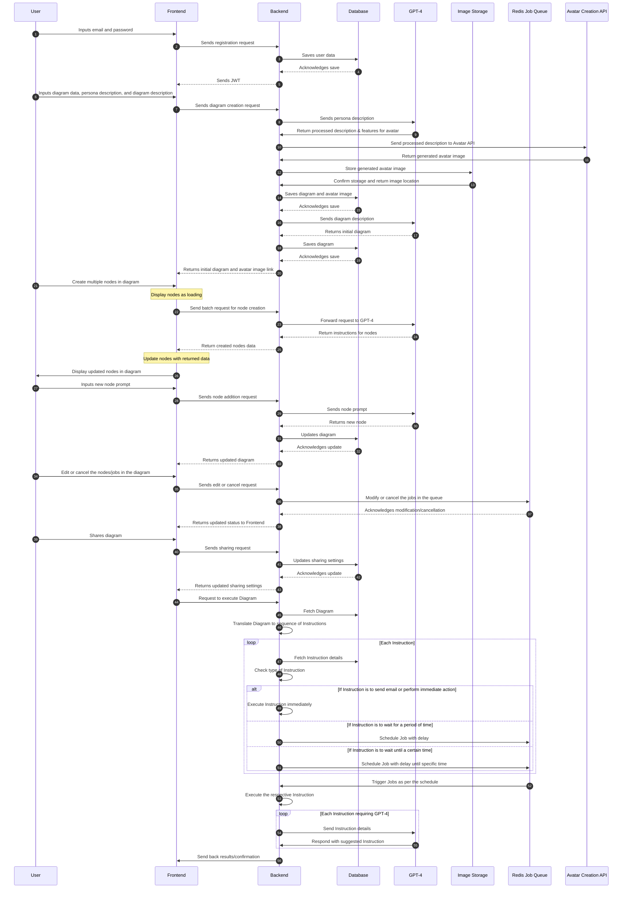

# MindFlow

MindFlow is a collaborative, real-time diagramming web application. It allows users to create and edit diagrams, collaborate with others in real-time, and share diagrams with different permissions.

## Features

- Real-time collaboration: Multiple users can work on the same diagram simultaneously and see changes in real-time.
- Various diagram types: MindFlow supports different types of diagrams such as flowcharts, mind maps, and organizational charts.
- User authentication: Users can register and log in to MindFlow using their email and password.
- Sharing capabilities: Users can share their diagrams with others and set different permissions for each collaborator.
- Notifications: Users receive notifications for diagram updates, comments, and mentions.

## Installation

To run MindFlow locally, follow these steps:

1. Clone the repository:

   ```bash
   git clone https://github.com/your-username/diagram-app.git
   ```

2. Install the dependencies for the frontend and backend:

   ```bash
   # Frontend
   cd diagram-app/frontend
   npm install

   # Backend
   cd ../backend
   npm install
   ```

3. Set up the environment variables:

   - Create a `.env` file in the `frontend` directory and add the following variables:

     ```
     NEXT_PUBLIC_API_URL=http://localhost:5000/api
     ```

   - Create a `.env` file in the `backend` directory and add the necessary variables for your database connection, JWT secret, etc.

4. Start the development servers:

   ```bash
   # Frontend
   cd diagram-app/frontend
   npm run dev

   # Backend
   cd ../backend
   npm run dev
   ```

5. Open your browser and navigate to `http://localhost:3000` to access MindFlow.

## Usage Examples

Here are some examples of how to use MindFlow:

1. Register a new user account.
2. Log in with your credentials.
3. Create a new diagram and add nodes to it.
4. Share the diagram with another user and set their permissions.
5. Collaborate with the other user in real-time and see changes instantly.
6. Receive notifications for diagram updates and comments.

## API Documentation

The API documentation for MindFlow can be found in the [API.md](backend/API.md) file. It provides detailed information about the available endpoints, request/response formats, and authentication requirements.

## License

This project is licensed under the [MIT License](LICENSE).

## Backend-Frontend Interaction



This sequence diagram illustrates the interaction between the frontend (F), backend (B), database (D), GPT-4 (AI), image storage (S), Redis job queue (Redis), and the Avatar Creation API (A) in the MindFlow application.

Please note that this is a simplified representation and may not include all the details of the actual implementation.

## License

This project is licensed under the [MIT License](LICENSE).